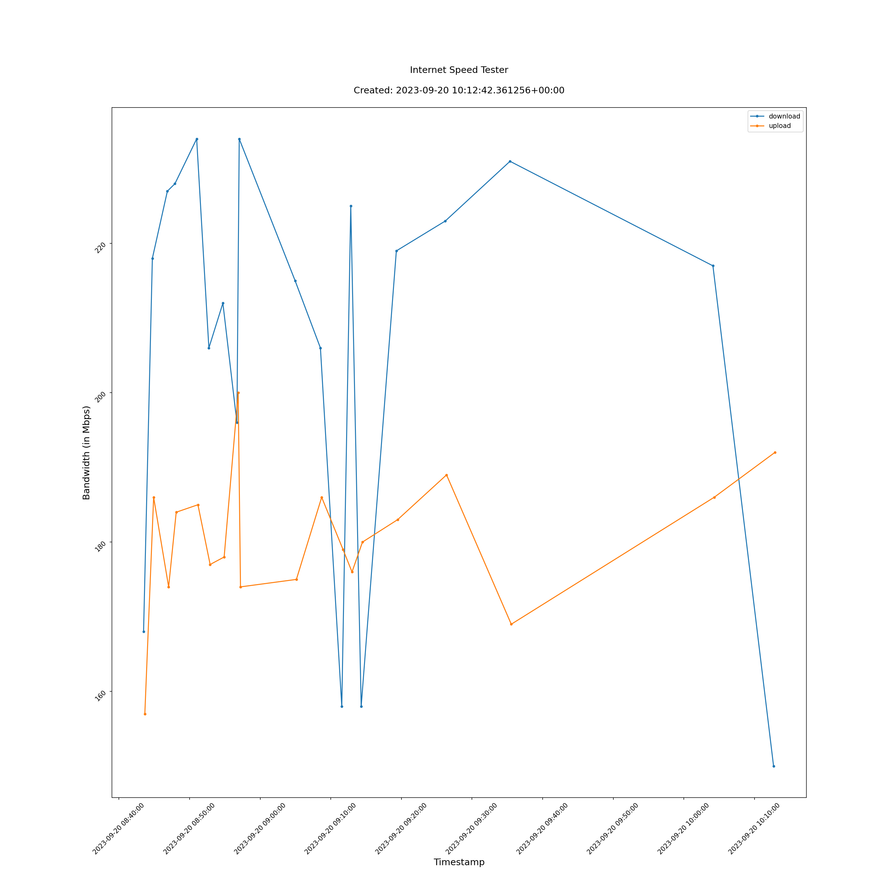

# Internet Speed Tester

[](https://github.com/psf/black)

Internet Speed Tester is a utility to measure your internet download/upload
speeds.

As troubleshooting intermittent drops in network bandwidth quickly became a
chore, I thought, "Surely Python has a library for this?"

----

## Prerequisites

I used and have only verified this utility with Python v3.10.6.

## Installation

Install the requirements.

```console
pip install -r ./requirements.txt
```

## Usage

Run the utility.

```console
./internet-speed-tester.py
```

## Output

### Logs (console and file)

```console
2023-09-20 10:35:33.652 | INFO     | __main__:test:95 - download => 242665638.52471566 bps
2023-09-20 10:35:40.816 | INFO     | __main__:test:95 - upload => 177631005.32555512 bps
```

`generated-2023-09-20-logger.log`

```json
{"text": "2023-09-20 10:35:33.652 | INFO     | __main__:test:95 - download => 242665638.52471566 bps\n", "record": {"elapsed": {"repr": "0:00:15.751255", "seconds": 15.751255}, "exception": null, "extra": {}, "file": {"name": "internet-speed-tester.py", "path": "/home/andrew/git/vadanx/internet-speed-tester/./internet-speed-tester.py"}, "function": "test", "level": {"icon": "ℹ️", "name": "INFO", "no": 20}, "line": 95, "message": "download => 242665638.52471566 bps", "module": "internet-speed-tester", "name": "__main__", "process": {"id": 14518, "name": "MainProcess"}, "thread": {"id": 139981989679104, "name": "MainThread"}, "time": {"repr": "2023-09-20 10:35:33.652541+01:00", "timestamp": 1695202533.652541}}}
{"text": "2023-09-20 10:35:40.816 | INFO     | __main__:test:95 - upload => 177631005.32555512 bps\n", "record": {"elapsed": {"repr": "0:00:22.915287", "seconds": 22.915287}, "exception": null, "extra": {}, "file": {"name": "internet-speed-tester.py", "path": "/home/andrew/git/vadanx/internet-speed-tester/./internet-speed-tester.py"}, "function": "test", "level": {"icon": "ℹ️", "name": "INFO", "no": 20}, "line": 95, "message": "upload => 177631005.32555512 bps", "module": "internet-speed-tester", "name": "__main__", "process": {"id": 14518, "name": "MainProcess"}, "thread": {"id": 139981989679104, "name": "MainThread"}, "time": {"repr": "2023-09-20 10:35:40.816573+01:00", "timestamp": 1695202540.816573}}}
```

### Data (file)

Contains recorded results of the test/s.

`generated-2023-09-20-data.json`

```json
{
    "download": {
        "1695202523.026182": {
            "time": "2023-09-20T09:35:23.026182+00:00",
            "value": 231.0
        }
    },
    "upload": {
        "1695202533.653841": {
            "time": "2023-09-20T09:35:33.653841+00:00",
            "value": 169.0
        }
    }
}
```

### Graph (file)

Contains visual results of the test/s.

`generated-2023-09-20-graph.png`


